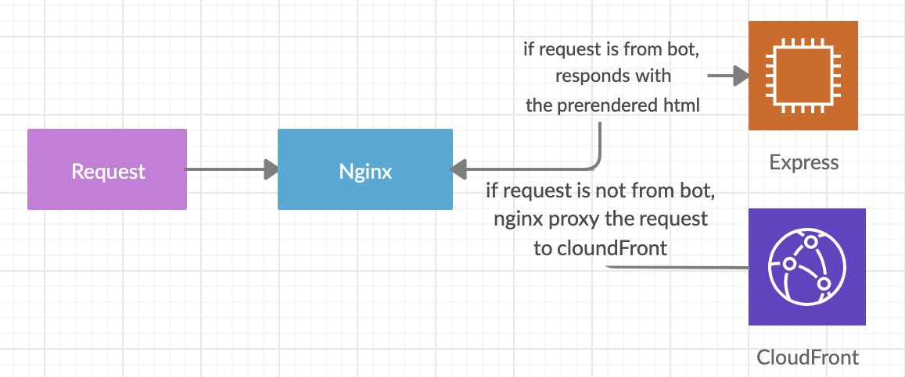

## Next.js를 사용해서 SSR을 하면서 부딪힌 문제 상황
&nbsp; 최근에 회사에서 웹 개편을 시작하면서 큼지막한 기술의 틀은 다음과 같이 정했었다. UI Framework로는 React, Styling을 위해서는 Styled-Component,
SSR(Server-side rendering)을 하기 위하여 Next.js까지. 다른 많은 라이브러리들도 사용했지만 주요 뼈대는 위와 같이 결정했고, 세팅부터
페이지 작업까지 열심히 달렸고 하나의 페이지를 위의 기술들을 사용하여 유저들에게 배포했다. 초반에는 큰 이슈 없이 정착하여 다른 페이지들까지 빠르게 이 프로젝트로 옮겨와야지라고 생각하며
열정을 불태우던 그 즈음. 몇몇 가지 문제들이 내부적으로 인식되었다. 그 당시에도 정확하게 글로 어떤 문제점이 있다라고 문서화를 하진 못했지만, 지금에서라도 정리해보면 다음과 같았다.

* 해외에서 요청을 한다든지 혹은 특정 시간에 `next.js의 응답이 느려지는 순간`이 있다.
* 그로 인하여, 이벤트나 특정 이유 때문에 traffic이 급작스럽게 몰렸을 경우 `next.js가 잘 견뎌 내지 못할 것이라는 걱정들이 많았고 실제로 굉장히 연약`했다.
* 하지만, 내부 인력들 중에서는 `node.js 서버에 대한 인프라 관리에 대한 경험치를 일정 수준 가지고 있는 사람이 없었다.`
* 그러므로, `프론트엔드 관련해서는 infra 관리를 최소화`하고 싶다.

## 새로운 SSR방식 시도
&nbsp; 하지만, 커머스를 하고 있는 입장에서 모든 페이지를 SPA로만 구현하고 그것에만 의존하자라는 결정을 할 순 없었다. 왜냐하면, 요즘은 사실 그렇게 크게 신경쓰지 않아도
검색엔진들이 잘 해주고 있지만 SEO를 최대한 보장받고 싶었다. 두 번째로는 마케팅이나 외부 플랫폼에 공유했을 때에 SPA처럼 무조건 하나의 메타 정보만을 보여 주어서는
안 되었다. node 서버나 infra에 대해서 어느 정도 노하우도 조금 생기고 익숙해져 갈 무렵, 리서치와 회의 끝에 이 글에서 설명할 첫 번째 방법으로의 변화를 시도해보기로 결정했다.
두 번째나 세 번째는 아직 회사에서도 개인적으로 시도해보진 않았지만 첫 번째 방법에 대한 복습을 이 글과 함께 시작 해보고 두 번째, 세 번째 방법도 나름 직접 구현해보고 마지막에 어떤 것이 스스로 생각했을 때에
현재로서 가장 합리적인 방법인가에 대한 답을 내려보고자 한다. 현재 나의 지식 안에서 가장 합리적일 거라고 생각하는 3가지는 다음과 같다.

> 1) `nginx + react + express (with puppeteer)` - [참고 repository](https://github.com/impressor615/nginx-react-prerender)  
> 2) (coming soon) next.js의 serverless  
> 3) (coming soon) cloudFront + lambda@edge  

&nbsp; 즉, 첫 번째 방식은 nginx가 요청을 받고 userAgent를 통해서 request가 bot에 의한 것인지 아닌 지에 따라서 다른 response를 하는 방식이다.
bot의 요청이라면 puppeteer가 브라우저를 띄워서 실제 html이 다 완성되었을 시기의 html을 캐시하고 보내도록 만들어 둔 express서버로 요청을 전달하고,
그렇지 않은 경우에는 로컬 머신에 가지고 있는 index.html이든 cloudFront에 올려져 있는 index.html이든 간에 그냥 index.html파일을 내려 준다.
작업을 하다 보니 경험적으로 느낀 것은 로컬 머신에 있는 index.html을 내려주게 되면 배포 과정에서 실제 server 코드에 대한 배포가 필요 없는 경우에도 배포를 해야 할 수 있기 때문에
빌드된 결과물을 s3에 올려두고 cloudFront에서 서빙하는 것이 더 빠른 개발과 배포에 좋을 듯 하다. 실제로 위에 언급한 방식을 간단히 그림을 그려 보면 다음과 같다.

&nbsp; 실제 infra까지 구성한 것은 아니지만, client와 server를 나누어서 직접 로컬에서 간단히 작동하는 수준까지만 작업해보았다.
연습 삼아 작성해본 코드는 위에 링크 혹은 이 [repository](https://github.com/impressor615/nginx-react-prerender)에서 확인할 수 있다. client라는 폴더에는
그냥 create-react-app과 react-router-dom을 활용한 간단히 테스트를 위해 필요한 react SPA를 구성했다. 그리고 server폴더에는 puppeteer를 사용해서
직접 해당 path에 대한 html을 chrome에서 동작시켜서 `window.prerenderReady`라는 전역변수가 `true`가 되는 시점에 html content를 bot에게 return하는
express서버 코드와 bot을 판별해 index.html을 그냥 내려줄 지 아니면 express server로 보낼 지 판단하는 간단한 `nginx.conf`가 있다.

## 스스로 생각해보는 장단점 및 결론

&nbsp; next.js를 사용하다가 문제가 있어서 다른 방식을 고안했다는 사실이 next.js가 SSR을 하기에 부적절했다기보다 부끄럽지만 제대로 사용하지 못했던 것이라 생각한다.
커뮤니티는 점점 더 활발해지고 심지어 next.js는 진짜 빨리 업데이트가 된다. 그래서 개인적으로 좋아하는 편이다. 결국 내가 문제였던 것으로.
다시 next.js를 사용한다면 cache를 조금 더 세심하게 다룬다면 더 안정성있게 구현할 수 있지 않을까 아쉬움이 남기도 한다.
무엇이든 유일한 답이란 없고 자신이 풀어야 하는 문제에 가장 합리적인 방법을 선택해야하는 것 뿐이지만. 마지막으로 nginx를 활용한 SSR하는 방법에 대한 장단점을 간단히 정리해보았다.

#### 장점
* 어차피 bot에 대한 요청에만 실행되기 때문에 response time에 대해서 실제 유저가 사용할 때만큼 신경쓰지 않아도 된다. 그래서, 마음껏 SEO를 신경쓰면서 SSR을 할 수 있다. 모든 API가 끝난 결과를 cache하면 된다. (하지만, 요즘은 사실 검색엔진이 crawling을 알아서 잘 해준다.)
* bot에 대한 요청에만 cache를 하기 때문에 cache의 조건이 사용자의 언어 정도까지만 생각하면 된다. (nextjs의 결과를 cache한다고하면 언어, 사용하는 기기, 로그인 여부 등등이 포함될 수 있는 가능성이 있다.)
* SPA를 개발하지만 SSR의 모든 장점을 같이 가져갈 수 있다.

#### 단점
* 조금 더 단순하긴 하지만, 역시나 nginx와 express가 떠 있을 instance, 캐시를 위한 redis, 많아질 traffic에 대비할 오토스케일링 등 infra관리가 필요하다.

&nbsp; 마지막으로 회사에서는 이 구성에 대해서 다른 동료 분이 구현해주셔서 직접 구현하지 않았지만 구현하시는 모습을 보면서 공부하는 마음으로
직접 구현을 해봐야 겠다는 마음을 들게 만들어 주시고 항상 좋은 조언과 에너지를 나눠 주시는 동료 분에게 감사한 마음을 전한다.

## 참고한 글
- https://developers.google.com/web/tools/puppeteer/articles/ssr
- https://github.com/prerender/prerender
